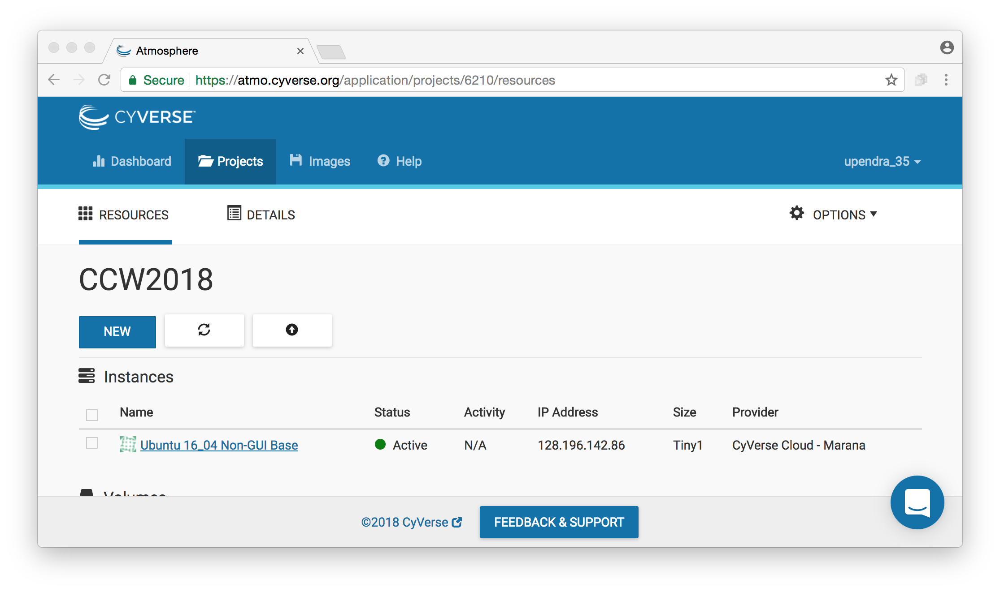
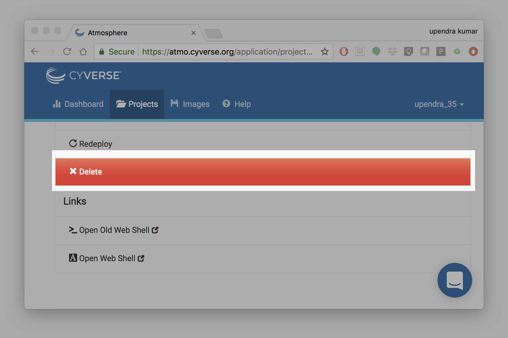

Booting a Atmosphere Computer Instance for your use!
----------------------------------------------------

What we're going to do here is walk through starting up an running
computer (an "instance") on the Atmosphere service.

Below, we've provided screenshots of the whole process. You can click
on them to zoom in a bit.  The important areas to fill in are circled
in red.

First, go to the `Atmosphere <https://atmo.cyverse.org/application/images>`_ application and then click `login`

1. Fill in the username and password and click "LOGIN"

Fill in the username, which is 'tx160085' for the Container Camp workshop,
and then enter the password (which we will tell you in class).

|atmo-1|
           
2. Select Projects and "Create New Project"

- Now, this is something you only need to once.

- We'll do this with Projects, which give you a bit of a workspace in which
to keep things that belong to "you".

- Click on "Projects" up along the top and name the project for yourself, click "create"

- Enter your name into the Project Name, and something simple like "CCW2018"
into the description. Then click 'create'.

|atmo_cp|

3. Select the newly created project

- Click on your new project!
           
- Within the project, select "new"

- Now, select 'New' and then "Instance" from the dropdown menu to start up a new machine.

- Find the "Ubuntu 16.04" image, click on it

- Name it something simple and select 'm1.medium'

Change the name after what we're doing - "workshop tutorial", for example,
but it doesn't matter -- and leave rest of the fields as default.

|atmo_launch|

Wait for it to become active

It will now be booting up! This will take 2-10 minutes, depending.
Just wait! Don't reload or anything.

|atmo-6|

Click on your new instance to get more information!

Now, you can either click "Open Web Shell", *or*, if you know how to use ssh,
you can ssh in as user 'tx160085' on the IP address of the machine - see
circled information below. 

|atmo-7|

Deleting your instance
======================

To completely remove your instance, you can select the "delete" buttom from the instance details page. 

This will open up a dialogue window. Select the "Yes, delete this instance" button.

|atmo-8|

It may take Jetstream a few minutes to process your request. The instance should disappear from the project when it has been successfully deleted. 

|atmo-9|

.. |atmo_cp| image:: ../img/atmo_cp.png
  :width: 750
  :height: 700

.. |atmo_launch| image:: ../img/atmo_launch.png
  :width: 750
  :height: 700

.. |atmo-7| image:: ../img/atmo-7.png
  :width: 750
  :height: 700

