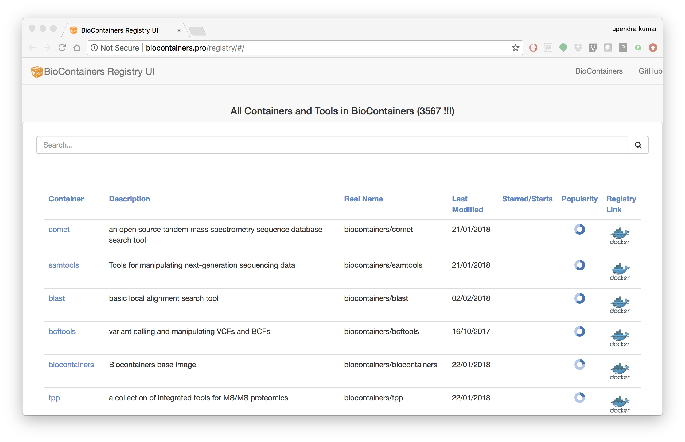
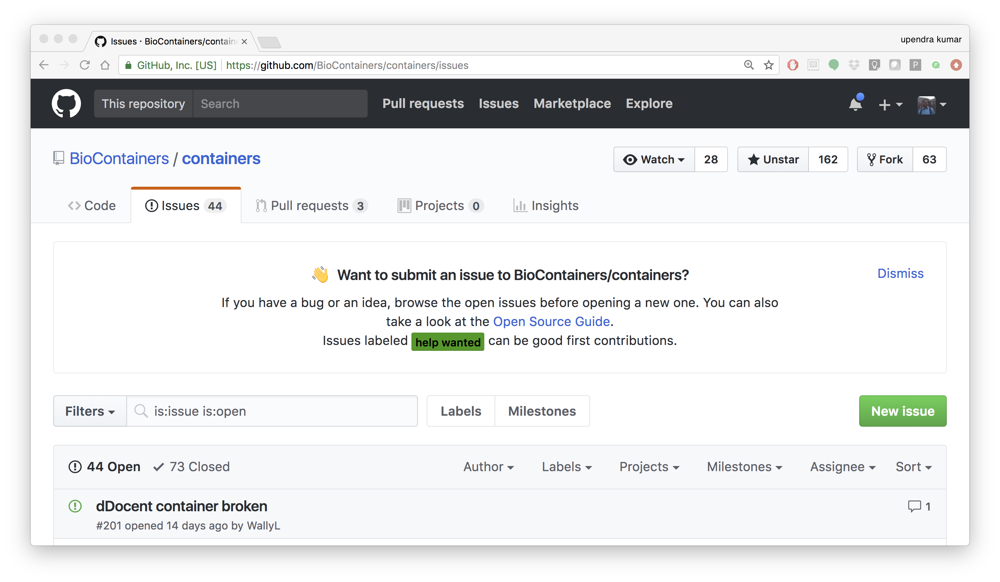

**Introduction to Biocontainers**
---------------------------------

BioContainers is a community-driven project that provides the infrastructure and basic guidelines to create, manage and distribute Bioinformatics containers with special focus in Proteomics, Genomics, Transcriptomics and Metabolomics. BioContainers is based on the popular frameworks of Docker. 

BioContainers Goals:

- Provide a base specification and images to easily build and deploy new bioinformatics/proteomics software including the source and examples.

- Provide a series of containers ready to be used by the bioinformatics community (https://github.com/BioContainers/containers).

- Define a set of guidelines and specifications to build a standardized container that can be used in combination with other containers and bioinformatics tools.

- Define a complete infrastructure to develop, deploy and test new bioinformatics containers using continuous integration suites such as Travis Continuous Integration (https://travisci. org/), Shippable (https://app.shippable.com/) or manually built solutions.

- Provide support and help to the bioinformatics community to deploy new containers for researchers that do not have bioinformatics support.

- Provide guidelines and help on how to create reproducible pipelines by defining, reusing and reporting specific container versions which will consistently produce the exact same result and always be available in the history of the container.

- Coordinate and integrate developers and bioinformaticians to produce best practice of documentation and software development.

Developing biocontainers
========================

1. Docker based Biocontainers
~~~~~~~~~~~~~~~~~~~~~~~~~~~~~

1.1 - How to Request a Biocontainer?

Users can request a container by opening an issue in the `containers repository <http://github.com/BioContainers/containers/issues>`_ 

|biocontainer-3|

The issue should contains the name of the software, the url of the code or binary to be package and information about the software. When the containers is deployed and fully functional, the issue will be closed by the developer or the contributor to BioContainers.

1.1.1 - Use a BioContainer

When a container is deployed and the developer closes the issue in GitHub the user received a notification that the container is ready. 

|biocontainer-4|

|biocontainer-5|

The user can then use `docker pull` or `docker run` for the corresponding container from `quay.io/biocontainers`. For example

.. code-block:: bash

	docker pull quay.io/biocontainers/khmer:2.1.2--py36_0

.. Note::

	Reporting a problem with a container:
	If the user find a problem with a container an issue should be open in the container repository, the user should use the broken tag (see tags). Developers of the project will pick-up the issue and deploy a new version of the container. A message will be delivered when the containers has been fixed.

1.2 - Create a Dockerfile for Biocontainer

If you are familiar with Docker (which you are by now!), then instead of requesting a biocontainer, you can create a Dockerfile and then submit the Dockerfile for biocontainer

- BioContainers dockerfile template

.. Note:: 

	Please always follow the best practices and help pages using input and output files information.

Below is the complete example of a BioContainers Dockerfile:

.. code-block:: bash

	# Base Image
	FROM biocontainers/biocontainers:latest

	# Metadata
	LABEL base.image="biocontainers:latest"
	LABEL version="3"
	LABEL software="Comet"
	LABEL software.version="2016012"
	LABEL description="an open source tandem mass spectrometry sequence database search tool"
	LABEL website="http://comet-ms.sourceforge.net/"
	LABEL documentation="http://comet-ms.sourceforge.net/parameters/parameters_2016010/"
	LABEL license="http://comet-ms.sourceforge.net/"
	LABEL tags="Proteomics"

	# Maintainer
	MAINTAINER Felipe da Veiga Leprevost <felipe@leprevost.com.br>

	USER biodocker

	RUN ZIP=comet_binaries_2016012.zip && \
	  wget https://github.com/BioDocker/software-archive/releases/download/Comet/$ZIP -O /tmp/$ZIP && \
	  unzip /tmp/$ZIP -d /home/biodocker/bin/Comet/ && \
	  chmod -R 755 /home/biodocker/bin/Comet/* && \
	  rm /tmp/$ZIP

	RUN mv /home/biodocker/bin/Comet/comet_binaries_2016012/comet.2016012.linux.exe /home/biodocker/bin/Comet/comet

	ENV PATH /home/biodocker/bin/Comet:$PATH

	WORKDIR /data/

	CMD ["comet"]

1.2.1 - Run it!, Test it! Once the container is ready you should test it, try to run your program using the run command, check if all its functionalities are in order.

1.2.2 - Contribute if everything looks OK. You can contribute to the BioContainers project by sending your Dockerfile.

2. Bioconda based Biocontainers
~~~~~~~~~~~~~~~~~~~~~~~~~~~~~~~

In contrast to traditional Biocontainers, Bioconda based Biocontainers offers a very easy way to create efficient containers that are minimal in size, tested and not rely on writing a Dockerfile.

The preferred way to do this is to write a conda package and submit this it the BioConda communtiy. As soon as your PR is merged and continues integration testing was successful, a container is built and publish it at `quay.io <https://quay.io/organization/biocontainers>`_.

In summary, a BioConda recipe should contain the following parts:

- Source URL is stable (details)
- md5 or sha256 hash included for source download (details)
- Appropriate build number (details)
- .bat file for Windows removed (details)
- Remove unnecessary comments (details)
- Adequate tests included
- Files created by the recipe follow the FSH (details)
- License allows redistribution and license is indicated in meta.yaml
- Package does not already exist in the defaults, r, or conda-forge channels with some exceptions (details)
- Package is appropriate for bioconda
- If the recipe installs custom wrapper scripts, usage notes should be added to extra -> notes in the meta.yaml.

Example Yaml for unicycler tool:

.. code-block:: bash

	package:
	  name: unicycler
	  version: 0.3.0b

	build:
	  number: 0
	  skip: True # [py27]

	source:
	  fn: unicycler_0.3.0b.tar.gz
	  url: https://github.com/rrwick/Unicycler/archive/906a3e7f314c7843bf0b4edf917593fc10baee4f.tar.gz
	  md5: 5f06d2bd8ef5065c8047421db8c7895f

	requirements:
	  build:
	  - python
	  - setuptools
	  - gcc

	  run:
	  - python
	  - libgcc
	  - spades >=3.6.2
	  - pilon
	  - java-jdk
	  - bowtie2
	  - samtools >=1.0
	  - blast
	  - freebayes

	test:
	  commands:
	    - unicycler -h
	    - unicycler_align -h
	    - unicycler_check -h
	    - unicycler_polish -h

	about:
	  home: https://github.com/rrwick/Unicycler
	  license: GPL-3.0
	  license_file: LICENSE
	  summary: 'Hybrid assembly pipeline for bacterial genomes'

When the recipe is ready a Pull Request should be created on the bioconda-recipes `github repo <https://bioconda.github.io/contribute-a-recipe.html#push-changes-wait-for-tests-to-pass-submit-pull-request>`_. Finally the container is automatically created for the new BioConda Package if everything is corrected

The following are the detailed steps involved in creating bioconda based biocontainers:

2.1 - One-time Setup

2.1.1 - Install Bioconda

Bioconda is a channel for the conda package manager specializing in bioinformatics software. It consists of:

- A repository of recipes hosted on GitHub
- A build system that turns these recipes into conda packages
- A repository of >1500 bioinformatics packages ready to use with a simple conda install command

Over 130 contributors that add, modify, update and maintain the recipes

.. important::

	**Recipe vs package**
	A **recipe** is a directory containing small set of files that defines name, version, dependencies, and URL for source code. A recipe 
	typically contains a meta.yaml file that defines these settings and a build.sh script that builds the software. A recipe is 
	converted into a package by running "conda-build" on the recipe. 
	A **package** is a bgzipped tar file (.tar.bz2) that contains the built software. Packages are uploaded to anaconda.org so that users can install them with "conda install" command.

Bioconda requires the conda package manager to be installed. If you have an Anaconda Python installation, you already have it. 
Otherwise, the best way to install it is with the Miniconda package.

.. warning::
	
	Bioconda supports only 64-bit Linux and Mac OSX. The Python 3 version is recommended.

Install miniconda specific for your platform. The following code shows the Miniconda installation on MacOSX and Linux

- MacOSX

.. code-block:: bash

	wget https://repo.continuum.io/miniconda/Miniconda3-latest-MacOSX-x86_64.sh
	bash Miniconda3-latest-MacOSX-x86_64.sh
 
- Linux

.. code-block:: bash

	wget https://repo.continuum.io/miniconda/Miniconda3-latest-Linux-x86_64.sh
	bash Miniconda3-latest-Linux-x86_64.sh
  
Accept all the default settings and let conda prepend the PATH in `~/.bashrc`
 
.. code-block:: bash

	source ~/.bashrc

If you already have miniconda installed on your MacOSX/Linux, you can update that using

.. code-block:: bash

	conda upgrade conda
	conda upgrade conda-build

2.1.2 - Setting up of Channels of Bioconda

After installing conda you will need to add the Bioconda channel as well as the other channels Bioconda depends on. It is important to run the following commands in this order so that the priority is set correctly.

.. code-block:: bash

	conda config --add channels conda-forge
	conda config --add channels defaults
	conda config --add channels r
	conda config --add channels bioconda

2.1.3 - Test Bioconda installation

After installing Bioconda and setting-up channels, test to see if the installation of Bioconda worked properly by installing a package

.. code-block:: bash

	conda install <package>
	 
	# Example
	conda install bwa
	# Or a specific version can be installed like this
	conda install bwa=0.7.12

If there are no errors during installation of `bwa`, your Bioconda set-up is complete

2.1.4 - Next, create a fork of bioconda-recipes repo onto your GitHub account and then clone it locally.

.. warning ::

	Create a github account if you don't have one already.

.. code-block:: bash

	git clone https://github.com/<githubUSERNAME>/bioconda-recipes.git

2.1.5 - Add the main bioconda-recipes repo as an upstream remote to more easily update your branch with the upstream master branch

.. code-block:: bash

	cd bioconda-recipes
	git remote add upstream https://github.com/bioconda/bioconda-recipes.git

2.1.6 - Request to be added to the Bioconda team

While not required, you can be added to the Bioconda by posting in `Issue #1 <https://github.com/bioconda/bioconda-recipes/issues/1>`_. Members of the Bioconda team can merge their own recipes once tests pass, though we ask that first-time contributions and anything out of the ordinary be reviewed by the @bioconda/core team.

Even if you are a member of the Bioconda team with push access, using your own fork will allow testing of your recipes 
on `travis-ci` using your own account’s free resources without consuming resources allocated by travis-ci to the Bioconda 
group. This makes the tests go faster for everyone.

Create the Tool's Required Bioconda recipe (for generating Biocontainers)

2.1.7 - Update Bioconda repo and requirements

Before starting, it’s best to update your fork with any changes made recently to the upstream Bioconda repo. Assuming you’ve set up your fork as above:

.. code-block:: bash

	git checkout master
	git pull upstream master

2.1.8 - Checkout a new branch

Check out a new branch in your fork (here the branch is arbitrarily named my-recipe):

.. code-block:: bash

	git checkout -b my-recipe

2.1.9 - Create the recipe

Before you create a recipe, make sure to check that package exists for that recipe. If the package is already present, then you don't need to create the recipe.
There are couple of ways to check for the package

1. Search for the package name in `here <http://bioconda.github.io/recipes.html>`_

2. Search for the package name on the command line

.. code-block:: bash

	conda search <package> -c bioconda
  
	# Example
	conda search taco -c bioconda

If the package of your interest, is not available, you can create the Bioconda recipe for the tool of your interest as below

.. code-block:: bash

	conda skeleton <source> <package>

.. Note::

	Source: The source of the tool can be pypi, cran, bioconductor or cpan. Guidelines for `Bioconda recipe <https://bioconda.github.io/guidelines.html>`_
	Package: The name of the package

If the tool is not available from any of the above sources, then you need to generate a Bioconda package from scratch.

2.2.0 - Test it locally

After creating your recipe (using one of the above methods), to make sure your recipe works, you need to test it locally. There are two options.

2.2.1 - Quick test

The quickest, but not necessarily most complete, is to run `conda-build` command directly

.. code-block:: bash

	conda install conda-build
	conda build ./<package>
  
	# Example
	conda build bowtie2/2.2.4

2.2.2 - Push your changes to your fork on github repo

Once your tests are successful, before pushing your changes to your fork on github, it is best to merge any changes that have happened recently on the upstream master branch. See sycncing a fork for details, or run

.. code-block:: bash

	git fetch upstream
 
syncs the fork's master branch with upstream

.. code-block:: bash

	git checkout master
	git merge upstream/master
 
merges those changes into the recipe's branch

.. code-block:: bash

	git checkout my-recipe
	git merge master
 
.. code-block:: bash

	push your changes to your fork on github
	git push origin my-recipe

2.2.3 - Open a pull request on the bioconda-recipes repo

.. Tip::

	If it’s your first recipe or the recipe is doing something non-standard, please ask `@bioconda/core` for a review.

2.2.4 - Test the built bioconda package and Biocontainer

After the pull request, travis-ci will again do the builds to make sure everthing works. When the pull request is merged with the master branch by Bioconda team, the package will be uploaded to anaconda.org and Biocontainers will be pushed to quay.io.

2.2.5 - Testing the Bioconda package

Once the Bioconda package is available on Anaconda and biocontainer is available on `quay.io`, it may be a good idea to test those in staging first, so that production jobs aren't interrupted.

2.2.5.1 - Install the built Bioconda package from Anaconda (optional but recommended)

.. code-block:: bash

	conda create -n myenvironment my-package # This is optional but it is always good to test this

This method will install the package in the `/home/username/minconda3/envs/myenvironment/bin`

2.2.5.2 - Testing the Biocontainer

- Pull your Biocontainer from quay.io of your new recipe (Mandatory)

.. code-block:: bash

	docker pull quay.io/biocontainers/<my-package>:<version-number>--<python-version>_<built-number>

Run the tool's Biocontainer using the image:tag name, sample parameters, and inputs given in the tool request with a docker run command.

If the tool crashes, or the output does not match the sample output, contact the Bioconda or the user who creates the Biocontainers.
Clean up any data containers and dangling images created in testing with `docker rm -v` and `docker rmi` commands.
This command will cleanup any 'dangling' images:

.. code-block:: bash

	docker rmi $(docker images -f 'dangling=true' -q)

The BioContainers Registry
==========================

BioContainers Registry UI provides the interface to search, tag, and document a BioContainers across all the registries.

|biocontainer-1|

The users can search containers by using the search box

|biocontainer-2|

The containers registry allow the users to sort the containers by any of these properties:

- Container Name: Container Name
- Description: Description Provided by the developer of the container.
- Real Name: The corresponding registry + container name
- Last Modified: Last date where the container has been modified.
- Starred/Start: If the container has been starred in any of the repos.
- Popularity: How many times a container has been pull from a registry.
- Registry Link: the registry Link.

.. |biocontainer-4| image:: ../img/biocontainer-4.png
  :width: 750
  :height: 700 

