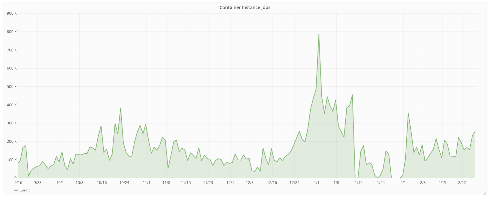

**OSG (Open Science Grid) Singularity Infrastructure**
------------------------------------------------------

1. Prerequisites
================

ssh will be used to connect to a remote job submit host. Please ensure you have a ssh client installed. The instructors will supply a slip of paper with username, password and hostname during the session.

2. OSG Overview
===============

The `Open Science Grid (OSG) <https://www.opensciencegrid.org/>`_ is a distributed infrastructure for high throughput computing. The OSG enables dozens of universities and labs to provide researchers with access to significant computing resources. The resources accessible through the OSG are contributed by the community, organized by the OSG, and governed by the OSG consortium. In the last 12 months, we have provided more than 1.2 Billion CPU hours to researchers across a wide variety of projects.

|osg_map|

This map is available "live" on the `OSG Display <https://display.grid.iu.edu/>`_ site.

2.1 Distributed High Throughput Computing
~~~~~~~~~~~~~~~~~~~~~~~~~~~~~~~~~~~~~~~~~

OSG is focusing on single core, or low number core jobs which can fit on a single node. Some guidelines:

- Use less than 2 GB memory 

- Each invocation should run for 1-12 hours

- Compute sites in the OSG can be configured to use preemption, which means jobs can be automatically killed if higher priority jobs enter the system. Preempted jobs will restart on another site, but it is important that the jobs can handle multiple restarts.

2.2 Motivations for Containers in OSG
~~~~~~~~~~~~~~~~~~~~~~~~~~~~~~~~~~~~~

Each computing resource exposes a slightly different operating system environment. Actually this capacity can be daunting for the individual: each site has its own discretion to setup their runtime environment in a unique way. 

.. Note:: 

	Before containers, OSG **used** to tell the users:
	
	- Binaries should preferably be statically linked. However, dynamically linked binaries with standard library dependencies, built for a 64-bit Red Hat Enterprise Linux (RHEL) 6 machines will also work. Also, interpreted languages such as Python or Perl will work as long as there are no special module requirements.

	- Software dependencies can be difficult to accommodate unless the software can be staged with the job.

Motivation for containers in OSG:

- **Consistent environment (default images)** - If a user does not specify a specific image, a default one is used by the job. The image contains a decent base line of software, and because the same image is used across all the sites, the user sees a more consistent environment than if the job landed in the environments provided by the individual sites.

- **Custom software environment (user defined images)** - Users can create and use their custom images, which is useful when having very specific software requirements or software stacks which can be tricky to bring with a job. For example: Python or R modules with dependencies, TensorFlow, ...

- **Enables special environment such as GPUs** - Special software environments to go and in hand with the special hardware.

- **Process isolation** - Sandboxes the job environment so that a job can not peek at other jobs.

- **File isolation** - Sandboxes the job file system, so that a job can not peek at other jobs' data.

2.3 Container Statistics
~~~~~~~~~~~~~~~~~~~~~~~~

These are for a subset of OSG, specifically for the OSG VO (Virtual Organization). Other VOs are also using containers.

|osg_container_count|

One challenge when running these many container per day, across 100's of sites and 1000's of compute nodes, is how do we distribute and access containers without putting unnecessary load on Docker and Singularity hubs? More about this below.

The breakdown of jobs shows about half runs without containers, and the once running in containers are mostly doing so under the default images.

|osg_container_breakdown|

3. CVMFS
========

The CernVM File System (CVMFS) is a highly-scalable global filesystem optimized for global distribution of software.  The CERN-based LHC experiments invested in this filesystem based on the experience of attempting to synchronize the install their complex application software stacks across hundreds of sites.  Each release may contain tens of gigabytes of data across hundreds of thousands of files; a few dozen to a hundred releases might be active at any given time. 

CVMFS is FUSE-based - a filesystem implemented in user space, not within the Linux kernel.  It scales well because changes to each repository are only written to a single repository node and then distributed throughout the CVMFS content distribution network (a hierarchical set of web servers and HTTP caches).  All writes are aggregated into a single transaction, making the rate of change relatively slow (typically, updates occur no faster than once every 15 minutes).  Since file contents are immutable, CVMFS is able to use a content-addressed scheme and the corresponding HTTP objects immutable.  Thus, the entire system is amenable to cache hierarchies.

CVMFS's original use case has significant parallels with distributing scientific containers: containers tend to be read-only, contain relatively large sets of software, and need to be accessed - without modification or corruption - at multiple sites.

|osg_cvmfs|

OSG stores container images on CVMFS in extracted form. That is, we take the Docker image layers or the Singularity img/simg files and export them onto CVMFS. For example, `ls` on one of the containers looks similar to `ls /` on any Linux machine:

.. code-block:: bash

	$ ls /cvmfs/singularity.opensciencegrid.org/opensciencegrid/osgvo-el7:latest/
	cvmfs  host-libs  proc  sys  anaconda-post.log     lib64
	dev    media      root  tmp  bin                   sbin
	etc    mnt        run   usr  image-build-info.txt  singularity
	home   opt        srv   var  lib

This is a very efficient way for use to distribute the images. Most jobs only need small parts of the actual image (as low as 25-100 MBs), and the CVMFS caching mechanism means those bits are aggressivly cached at both the site and node level.

3.1 cvmfs-singularity-sync
~~~~~~~~~~~~~~~~~~~~~~~~~~

Information on how to register your image can be found on the `Docker and Singularity Containers <https://display.grid.iu.edu/>`_ page in the OSG Help Desk. It says:

In order to be able to efficiently distribute the container images to a large of distributed compute hosts, OSG has chosen to host the images under CVMFS. Any image **publicly** available in Docker can be included for automatic syncing into the CVMFS repository. The result is an unpacked image under `/cvmfs/singularity.opensciencegrid.org/`

To get your images included, please either create a git pull request against `docker_images.txt` in the `cvmfs-singularity-sync <https://github.com/opensciencegrid/cvmfs-singularity-sync>`_ repository, or contact user-support@opensciencegrid.org and we can help you.

Once your image has been registered, new versions pushed to Docker Hub will automatically be detected and CVMFS will be updated accordingly.

4. Exercise 1: Exploring Available Images
=========================================

Log in via ssh to the training account provided on the slip of paper. `workflow.isi.edu` is a submit host for both Open Science Grid as well as a local HTCondor pool.

Look at at the directories and sub directories under `/cvmfs/singularity.opensciencegrid.org`

.. code-block:: bash

	$ ls /cvmfs/singularity.opensciencegrid.org/

Note how the directories in here relate to the `docker_images.txt` in the `cvmfs-singularity-sync` repository (`link <https://github.com/opensciencegrid/cvmfs-singularity-sync/blob/master/docker_images.txt>`_).

Let's explore an image which is different from the host operating system (CentOS 7). A good example of this is the TensorFlow image which is based on Ubuntu 16.04. Start an interactive shell and explore the environment, including verifying that TensorFlow is available and what version it is:

.. code-block:: bash

	$ singularity shell /cvmfs/singularity.opensciencegrid.org/opensciencegrid/tensorflow:latest/
	Singularity: Invoking an interactive shell within container...

	$ cat /etc/issue
	Ubuntu 16.04.3 LTS

	$ python3 -c 'import tensorflow as tf; print(tf.__version__)'
	1.4.0

	$ exit

Make sure you run `exit` as the remaining exercises will be run under the host operating system.

5. Exercise 2: Containerized Job - Default Image
================================================

.. Note:: 

	These exercises will continue to use the `workflow.isi.edu` submit host. If you want to use OSG for your research in the future, please sign up for an account on `OSG Connect <http://osgconnect.net/>`_ and then use the OSG Connect submit hosts.

	More information on how to run jobs on OSG can be found in the `OSG Connect Quick Start Guide <https://support.opensciencegrid.org/solution/articles/5000633410-osg-connect-quickstart>`_

You will find an example HTCondor job under `~/ContainerCamp/OSG-02-Default-Image/`. Look at the content of `test-1.submit`

.. code-block:: bash

	$ cd ~/ContainerCamp/OSG-02-Default-Image/
	$ cat test-1.submit

The submit file specifies that we want Singularity, but not which image:

.. code-block:: none

	Requirements = HAS_SINGULARITY == True

Submit a job with:

.. code-block:: bash

	$ condor_submit test-1.submit

Check on the job with `condor_q` or `condor_q -nobatch`:

.. code-block:: bash
	
	$ condor_q
	$ connor_q -nobatch

Once the job is complete, examine the created `job.*.output` file:

.. code-block:: bash
	
	$ cat job.920697.0.output
	Hello! I'm running on the site MWT2 on the node uct2-c235.mwt2.org
	My Singularity image is /cvmfs/singularity.opensciencegrid.org/opensciencegrid/osgvo-el6:latest

Open Science Grid has multiple default images! Currently, we have one for RHEL 6 and one for RHEL 7. The dynamic pool of resources contains a mix of these defaults. Most of the OSG users only cares about the base OS, and not whether it is a Singularity instance or not. A common requirments line is `Requirements = OSGVO_OS_STRING == "RHEL 6" && Arch == "X86_64" &&  HAS_MODULES == True` which maps to RHEL 6 (Singularity or native), on 64 bit host and which as a `modules` software. For fun, we can steer our jobs to a Singularity RHEL 7 instance. Let's take a look at `test-2.submit` requirments:

.. code-block:: none

    Requirements = HAS_SINGULARITY == True && OSGVO_OS_STRING == "RHEL 7"

Submit the job and examine the output just like for the first job:

.. code-block:: bash

	$ condor_submit test-2.submit

6. Exercise 3: Containerized Job - Custom Image
===============================================

To run a job with a custom image, the `+SingularityImage` is used in the submit file to specify what image should be used. Change your working directory into `~/ContainerCamp/OSG-03-Custom-Image` and look at the test-1.submit file

.. code-block:: bash

	$ cd ~/ContainerCamp/OSG-03-Custom-Image/
	$ cat test-1.submit
	...
	Requirements = HAS_SINGULARITY == True
	+SingularityImage = "/cvmfs/singularity.opensciencegrid.org/opensciencegrid/tensorflow:latest"
	...

Using `+SingularityImage`, you can specify any image available under `/cvmfs/singularity.opensciencegrid.org/`. Just like we did above, you can run this job and see what the output shows.

OSG also has **limited** support for pulling images directly from Singularity Hub, Docker Hub, or over http. This is pass-through functionallity of what Singularity can do (see the `Singularity Quickstart Guide <http://singularity.lbl.gov/quickstart>`_). This is a less efficient way to access the images, so only use this for small workloads. For larger workloads, please use the CVMFS approach. Also note that the APIs change, so pulling images directly from the hubs can be Singularity version sensitive. `test-2.submit` shows how we can specify that the job should use Singularity 2.4.2 and pull directly from the Singularity Hub. `+SingularityBindCVMFS = False` is required for images which do not have the /cvmfs directory and do not want to have CVMFS access.

.. code-block:: bash

	$ cat test-2.submit
	...
	Requirements = HAS_SINGULARITY == True && OSG_SINGULARITY_VERSION == "2.4.2-dist"
	+SingularityImage = "shub://singularityhub/ubuntu"
	+SingularityBindCVMFS = False
	...

.. |osg_map| image:: ../img/osg_map.png
  :width: 750
  :height: 700 

.. |osg_cvmfs| image:: ../img/osg_cvmfs.png
  :width: 750
  :height: 700 

