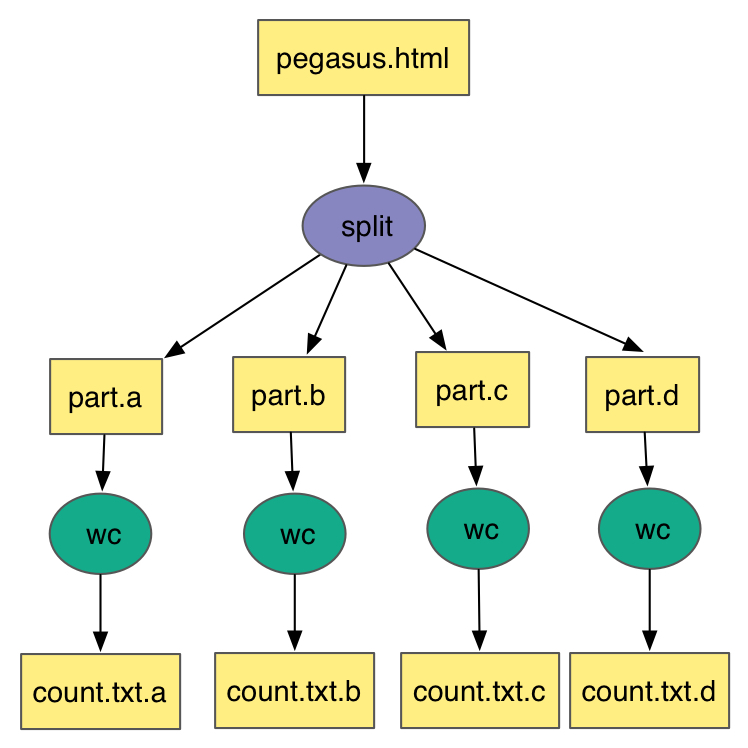
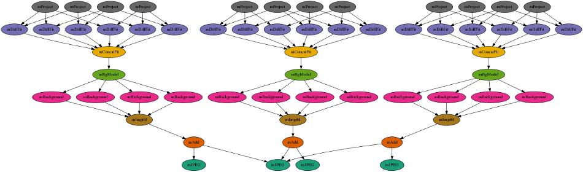

**Pegasus Workflows with Application Containers**
-------------------------------------------------

.. Note:: 
	This section contains an overview of scientific workflows, Pegasus, and how containers fits into Pegasus workflows. We will not have time to thoroughly cover all aspects of Pegasus - for future reference please see the `user guide <https://pegasus.isi.edu/documentation/>`_ and `self guided tutorial <https://pegasus.isi.edu/documentation/tutorial.php>`_.

1. Prerequisites
================

ssh will be used to connect to a remote job submit host. Please ensure you have a ssh client installed. The instructors will supply a slip of paper with username, password and hostname during the session.

2. What are Scientific Workflows?
=================================

Scientific workflows allow users to easily express multi-step computational tasks, for example retrieve data from an instrument or a database, reformat the data, and run an analysis. A scientific workflow describes the dependencies between the tasks and in most cases the workflow is described as a directed acyclic graph (DAG), where the nodes are tasks and the edges denote the task dependencies. A defining property for a scientific workflow is that it manages data flow. The tasks in a scientific workflow can be everything  from short serial tasks to very large parallel tasks (MPI for example) surrounded by a large number of small, serial tasks used for pre- and post-processing.

|pegasus_diamond|

2. Pegasus Workflow Management System
=====================================

Pegasus WMS is a configurable system for mapping and executing abstract application workflows over a wide range of execution environments including a laptop, a campus cluster, a Grid, or a commercial or academic cloud. Today, Pegasus runs workflows on Amazon EC2, Google Compute Engine, Open Science Grid, XSEDE, and campus clusters. One workflow can run on a single system or across a heterogeneous set of resources.

Pegasus WMS bridges the scientific domain and the execution environment by automatically mapping high-level workflow descriptions onto distributed resources. It automatically locates the necessary input data and computational resources necessary for workflow execution. Pegasus enables scientists to construct workflows in abstract terms without worrying about the details of the underlying execution environment or the particulars of the low-level specifications required by the middleware (Condor, Globus, or Amazon EC2). Pegasus WMS also bridges the current cyberinfrastructure by effectively coordinating multiple distributed resources. The input to Pegasus is a description of the abstract workflow in XML format.

Pegasus has a number of features that contribute to its useability and effectiveness.

- **Portability / Reuse**. User created workflows can easily be run in different environments without alteration. Pegasus currently runs workflows on top of Condor, Grid infrastrucutures such as Open Science Grid and TeraGrid, Amazon EC2, Nimbus, and many campus clusters. The same workflow can run on a single system or across a heterogeneous set of resources.

- **Performance**. The Pegasus mapper can reorder, group, and prioritize tasks in order to increase the overall workflow performance.

- **Scalability**. Pegasus can easily scale both the size of the workflow, and the resources that the workflow is distributed over. Pegasus runs workflows ranging from just a few computational tasks up to millions of tasks. The number of resources involved in executing a workflow can scale as needed without any impediments to performance.

- **Provenance**. By default, all jobs in Pegasus are launched via the kickstart process that captures runtime provenance of the job and helps in debugging. The provenance data is collected in a database, and the data can be summarised with tools such as pegasus-statistics, pegasus-plots, or directly with SQL queries.

- **Data Management**. Pegasus handles replica selection, data transfers and output registrations in data catalogs. These tasks are added to a workflow as auxilliary jobs by the Pegasus planner.

- **Reliability**. Jobs and data transfers are automatically retried in case of failures. Debugging tools such as pegasus-analyzer helps the user to debug the workflow in case of non-recoverable failures.

- **Error Recovery**.  When errors occur, Pegasus tries to recover when possible by retrying tasks, by retrying the entire workflow, by providing workflow-level checkpointing, by re-mapping portions of the workflow, by trying alternative data sources for staging data, and, when all else fails, by providing a rescue workflow containing a description of only the work that remains to be done. It cleans up storage as the workflow is executed so that data-intensive workflows have enough space to execute on storage-constrained resource. Pegasus keeps track of what has been done (provenance) including the locations of data used and produced, and which software was used with which parameters.

3. Exercise 1: Without Containers
=================================

All of the example workflows described in the previous section can be generated with the pegasus-init command. For this tutorial we will be using the split workflow, which can be created like this:

.. code-block:: bash

	$ pegasus-init split
	Do you want to generate a tutorial workflow? (y/n) [n]: y
	1: Local Machine
	2: USC HPCC Cluster
	3: OSG from ISI submit node
	4: XSEDE, with Bosco
	5: Bluewaters, with Glite
	What environment is tutorial to be setup for? (1-5) [1]: 3
	1: Process
	2: Pipeline
	3: Split
	4: Merge
	5: EPA (requires R)
	What tutorial workflow do you want? (1-5) [1]: 3
	Do you want to use Condor file transfers (y/n) [y]: y
	Pegasus Tutorial setup for example workflow - split for execution on osg

The split workflow looks like this:

|pegasus_split_wf|

The input workflow description for Pegasus is called the DAX. It can be generated by running the `generate_dax.sh` script from the split directory, like this:

.. code-block:: bash

	$ ./generate_dax.sh split.dax
	Generated dax split.dax
    
This script will run a small Python program (`daxgen.py`) that generates a file with a .dax extension using the Pegasus Python API. Pegasus reads the DAX and generates an executable HTCondor workflow that is run on an execution site.

The `pegasus-plan` command is used to submit the workflow through Pegasus. The `pegasus-plan` command reads the input workflow (DAX file specified by --dax option), maps the abstract DAX to one or more execution sites, and submits the generated executable workflow to HTCondor. Among other things, the options to `pegasus-plan` tell Pegasus

- the workflow to run
  
- where (what site) to run the workflow

- the input directory where the inputs are placed
  
- the output directory where the outputs are placed

By default, the workflow is setup to run on the compute sites (i.e sites with handle other than "local") defined in the `sites.xml` file. In our example, the workflow will run on a site named "condorpool" in the `sites.xml` file.

.. code-block:: bash

	$ ./plan_dax.sh split.dax 
	 
	-----------------------------------------------------------------------
	File for submitting this DAG to HTCondor       : split-0.dag.condor.sub
	Log of DAGMan debugging messages               : split-0.dag.dagman.out
	Log of HTCondor library output                 : split-0.dag.lib.out
	Log of HTCondor library error messages         : split-0.dag.lib.err
	Log of the life of condor_dagman itself        : split-0.dag.dagman.log
	-----------------------------------------------------------------------
	Submitting to condor split-0.dag.condor.sub
	Submitting job(s).
	1 job(s) submitted to cluster 920589.
	
	Your workflow has been started and is running in the base directory:
	
	  /split/submit/pegtrain50/pegasus/split/run0001
	
	*** To monitor the workflow you can run ***
	
	  pegasus-status -l /split/submit/pegtrain50/pegasus/split/run0001
	
	*** To remove your workflow run ***
	
	  pegasus-remove /split/submit/pegtrain50/pegasus/split/run0001
	 

This is what the split workflow looks like after Pegasus has finished planning the DAX:

|pegasus_split_dag|

You can monitor the workflow with the `pegasus-status` command provided in the output of the `plan_dax.sh` command:

.. code-block:: bash
	  
	pegasus-status -l /split/submit/pegtrain50/pegasus/split/run0001

More details on how to run basic workflow can be found in the `Pegasus Tutorial <https://pegasus.isi.edu/documentation/tutorial.php>`_

4. Exercise 2: With Containers
==============================

Now when we have a basic understanding of what a Pegasus workflow looks like, let's use containers to run some real science codes. This example is based on IPAC's `Montage <http://montage.ipac.caltech.edu/>`_ toolkit, which is used to process and create astronomical image mosaics of from telescope images datasets. The workflow has a few software dependencies: Montage obviously, but also Python modules like AstroPy. These could be installed on the cluster you want to run the workflow on, but using containers makes it even easier!

Not only will we make the compute jobs run inside containers, but also the data find step needed to construct the workflow. IPAC provides services to list the images available for a given location in the sky (for example, see the documentation for `mArchiveList <http://montage.ipac.caltech.edu/docs/mArchiveList.html>`_). For this querying we will use the same container as the jobs will be using. To get started, clone the Montage workflow from GitHub, and run the data find step:

.. code-block:: bash

	$ cd ~
	$ git clone https://github.com/pegasus-isi/montage-workflow-v2.git
	$ cd montage-workflow-v2
	$ singularity exec \
	              --bind $PWD:/srv --pwd /srv \
	              shub://pegasus-isi/montage-workflow-v2 \
	              /srv/montage-workflow.py \
	                  --tc-target container \
	                  --center "275.196290 -16.171530" \
	                  --degrees 0.2 \
	                  --band 2mass:j:green \
	                  --band 2mass:h:blue \
	                  --band 2mass:k:red

The three different `band` arguments specify different bands that we want to find images for, and map to `blue`, `green`, and `red` in to the final image. The output of the command should show a few images found for each band:

.. code-block:: none

	Progress |===================================| 100.0% 

	Adding band 1 (2mass j -> green)
	Running sub command: mArchiveList 2mass j "275.196290 -16.171530" 0.284 0.284 data/1-images.tbl
	[struct stat="OK", module="mArchiveList", count=8]
	Running sub command: cd data && mDAGTbls 1-images.tbl region-oversized.hdr 1-raw.tbl 1-projected.tbl 1-corrected.tbl
	[struct stat="OK", count="8", total="8"]
	Running sub command: cd data && mOverlaps 1-raw.tbl 1-diffs.tbl
	[struct stat="OK", module="mOverlaps", count=13]

	Adding band 2 (2mass h -> blue)
	Running sub command: mArchiveList 2mass h "275.196290 -16.171530" 0.284 0.284 data/2-images.tbl
	[struct stat="OK", module="mArchiveList", count=8]
	Running sub command: cd data && mDAGTbls 2-images.tbl region-oversized.hdr 2-raw.tbl 2-projected.tbl 2-corrected.tbl
	[struct stat="OK", count="8", total="8"]
	Running sub command: cd data && mOverlaps 2-raw.tbl 2-diffs.tbl
	[struct stat="OK", module="mOverlaps", count=13]

	Adding band 3 (2mass k -> red)
	Running sub command: mArchiveList 2mass k "275.196290 -16.171530" 0.284 0.284 data/3-images.tbl
	[struct stat="OK", module="mArchiveList", count=8]
	Running sub command: cd data && mDAGTbls 3-images.tbl region-oversized.hdr 3-raw.tbl 3-projected.tbl 3-corrected.tbl
	[struct stat="OK", count="8", total="8"]
	Running sub command: cd data && mOverlaps 3-raw.tbl 3-diffs.tbl
	[struct stat="OK", module="mOverlaps", count=13]

The `data/` directory contains the imformation about the input images, the generated workflow (`data/montage.dax`) and the transformation catalog (`data/tc.txt`) which tells Pegasus where software is available. A job in the `data/montage.dax` file might look like:

.. code-block:: xml

	<job id="ID0000001" name="mProject">
	    <argument>-X <file name="2mass-atlas-990502s-j1420198.fits"/> <file name="p2mass-atlas-990502s-j1420198.fits"/> <file name="region-oversized.hdr"/></argument>
	    <uses name="region-oversized.hdr" link="input"/>
	    <uses name="2mass-atlas-990502s-j1420198.fits" link="input"/>
	    <uses name="p2mass-atlas-990502s-j1420198.fits" link="output" transfer="false"/>
	    <uses name="p2mass-atlas-990502s-j1420198_area.fits" link="output" transfer="false"/>
	</job>

`data/tc.txt` has the specification on how `mProject` can be executed:

.. code-block:: none

	tr mProject {
	  site condor_pool {
	    type "INSTALLED"
	    container "montage"
	    pfn "file:///opt/Montage/bin/mProject"
	    profile pegasus "clusters.size" "3"
	  }
	}

Note the `container "montage"` part - this is a reference to the top of the file which has:

.. code-block:: none

	cont montage {
	   type "singularity"
	   image "shub://pegasus-isi/montage-workflow-v2"
	   profile env "MONTAGE_HOME" "/opt/Montage"
	}

Which is the same container we used for the data find step. Note that container images is just like any other piece of data to Pegasus. In this case, the image will be downloaded **once** from the Singularity Hub, and then shipped around to the jobs with the same mechanism as any other data in the workflow.

There is currently a small issue by running the data find step inside a container - the paths for the files are based on paths in the container which are different from what Pegasus expects on the submit host. The following command adjusts those paths:

.. code-block:: bash

	$ perl -p -i -e "s;/srv/data;$PWD/data;g" data/rc.txt

Now we are are ready to plan and submit the workflow:

.. code-block:: bash

	$ pegasus-plan \
	        --dir work \
	        --relative-dir `date +'%s'` \
	        --dax data/montage.dax \
	        --sites condor_pool \
	        --output-site local \
	        --submit

The workflow will looks something like this:

|pegasus_montage_dax|

The first level reprojects the input images to a common projection. The images are then fitted together. A background correction is applied so that the the final image will be seamless. The last step is to take the 3 different color bands, and add them together into a final output image:

|pegasus_montage_result|

To see how Pegasus handled the container in this case, let's look at some plumming for one of the `mProject` job. The HTCondor submit file can be seen with:

.. code-block:: bash

	$ cat `find . -name mProject_ID0000002.sub`

Look at the `transfer_input_files` attribute line, and specifically for the `montage.simg` file. It is transferred together with all the other inputs for the job:

.. code-block:: none

	transfer_input_files = region-oversized.hdr,2mass-atlas-990502s-j1350092.fits,montage.simg,/opt/training/pegasus-4.8.2dev/share/pegasus/sh/pegasus-lite-common.sh,/scitech/home/pegtrain99/montage-workflow-v2/work/1520295762/pegasus-worker-4.8.2dev-x86_64_rhel_7.tar.gz

Looking at the corresponding `.sh` file we can see how Pegasus executed the container:

.. code-block:: bash

	$ cat `find . -name mProject_ID0000002.sh`
	...
	singularity exec --pwd /srv --scratch /var/tmp --scratch /tmp --home $PWD:/srv montage.simg ./mProject_ID0000002-cont.sh
	...

The `./mProject_ID0000002-cont.sh` is a script generated at runtime, containing the execution of the user codes.

.. |pegasus_diamond| image:: ../img/pegasus_diamond.png
  :width: 300
  :height: 300 

.. |pegasus_split_dag| image:: ../img/pegasus_split_dag.png
  :width: 750
  :height: 700 

