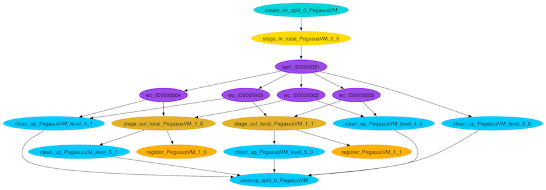

Pegasus Workflows with Application Containers
---------------------------------------------

1. Prerequisites
================

ssh will be used to connect to a remote job submit host. Please ensure you have a ssh client installed. The instructors will supply a slip of paper with username, password and hostname during the session.

2. What are Scientific Workflows?
=================================

Scientific workflows allow users to easily express multi-step computational tasks, for example retrieve data from an instrument or a database, reformat the data, and run an analysis. A scientific workflow describes the dependencies between the tasks and in most cases the workflow is described as a directed acyclic graph (DAG), where the nodes are tasks and the edges denote the task dependencies. A defining property for a scientific workflow is that it manages data flow. The tasks in a scientific workflow can be everything  from short serial tasks to very large parallel tasks (MPI for example) surrounded by a large number of small, serial tasks used for pre- and post-processing.

|pegasus_diamond|

2. Pegasus Workflow Management System
=====================================

Pegasus WMS is a configurable system for mapping and executing abstract application workflows over a wide range of execution environments including a laptop, a campus cluster, a Grid, or a commercial or academic cloud. Today, Pegasus runs workflows on Amazon EC2, Google Compute Engine, Open Science Grid, XSEDE, and campus clusters. One workflow can run on a single system or across a heterogeneous set of resources.

Pegasus WMS bridges the scientific domain and the execution environment by automatically mapping high-level workflow descriptions onto distributed resources. It automatically locates the necessary input data and computational resources necessary for workflow execution. Pegasus enables scientists to construct workflows in abstract terms without worrying about the details of the underlying execution environment or the particulars of the low-level specifications required by the middleware (Condor, Globus, or Amazon EC2). Pegasus WMS also bridges the current cyberinfrastructure by effectively coordinating multiple distributed resources. The input to Pegasus is a description of the abstract workflow in XML format.

Pegasus has a number of features that contribute to its useability and effectiveness.

- **Portability / Reuse**. User created workflows can easily be run in different environments without alteration. Pegasus currently runs workflows on top of Condor, Grid infrastrucutures such as Open Science Grid and TeraGrid, Amazon EC2, Nimbus, and many campus clusters. The same workflow can run on a single system or across a heterogeneous set of resources.

- **Performance**. The Pegasus mapper can reorder, group, and prioritize tasks in order to increase the overall workflow performance.

- **Scalability**. Pegasus can easily scale both the size of the workflow, and the resources that the workflow is distributed over. Pegasus runs workflows ranging from just a few computational tasks up to millions of tasks. The number of resources involved in executing a workflow can scale as needed without any impediments to performance.

- **Provenance**. By default, all jobs in Pegasus are launched via the kickstart process that captures runtime provenance of the job and helps in debugging. The provenance data is collected in a database, and the data can be summarised with tools such as pegasus-statistics, pegasus-plots, or directly with SQL queries.

- **Data Management**. Pegasus handles replica selection, data transfers and output registrations in data catalogs. These tasks are added to a workflow as auxilliary jobs by the Pegasus planner.

- **Reliability**. Jobs and data transfers are automatically retried in case of failures. Debugging tools such as pegasus-analyzer helps the user to debug the workflow in case of non-recoverable failures.

- **Error Recovery**.  When errors occur, Pegasus tries to recover when possible by retrying tasks, by retrying the entire workflow, by providing workflow-level checkpointing, by re-mapping portions of the workflow, by trying alternative data sources for staging data, and, when all else fails, by providing a rescue workflow containing a description of only the work that remains to be done. It cleans up storage as the workflow is executed so that data-intensive workflows have enough space to execute on storage-constrained resource. Pegasus keeps track of what has been done (provenance) including the locations of data used and produced, and which software was used with which parameters.

3. Exercise 1: Without Containers
=================================

All of the example workflows described in the previous section can be generated with the pegasus-init command. For this tutorial we will be using the split workflow, which can be created like this:

.. code-block:: bash

	$ pegasus-init split
	Do you want to generate a tutorial workflow? (y/n) [n]: y
	1: Local Machine
	2: USC HPCC Cluster
	3: OSG from ISI submit node
	4: XSEDE, with Bosco
	5: Bluewaters, with Glite
	What environment is tutorial to be setup for? (1-5) [1]: 3
	1: Process
	2: Pipeline
	3: Split
	4: Merge
	5: EPA (requires R)
	What tutorial workflow do you want? (1-5) [1]: 3
	Do you want to use Condor file transfers (y/n) [y]: y
	Pegasus Tutorial setup for example workflow - split for execution on osg

The split workflow looks like this:

|pegasus_split_wf|

The input workflow description for Pegasus is called the DAX. It can be generated by running the `generate_dax.sh` script from the split directory, like this:

.. code-block:: bash

	$ ./generate_dax.sh split.dax
	Generated dax split.dax
    
This script will run a small Python program (`daxgen.py`) that generates a file with a .dax extension using the Pegasus Python API. Pegasus reads the DAX and generates an executable HTCondor workflow that is run on an execution site.

The `pegasus-plan` command is used to submit the workflow through Pegasus. The `pegasus-plan` command reads the input workflow (DAX file specified by --dax option), maps the abstract DAX to one or more execution sites, and submits the generated executable workflow to HTCondor. Among other things, the options to `pegasus-plan` tell Pegasus

- the workflow to run
  
- where (what site) to run the workflow

- the input directory where the inputs are placed
  
- the output directory where the outputs are placed

By default, the workflow is setup to run on the compute sites (i.e sites with handle other than "local") defined in the `sites.xml` file. In our example, the workflow will run on a site named "condorpool" in the `sites.xml` file.

.. code-block:: bash

	$ ./plan_dax.sh split.dax 
	 
	----------------------------------------------------------------------- 
	File for submitting this DAG to HTCondor       : split-0.dag.condor.sub 
	Log of DAGMan debugging messages               : split-0.dag.dagman.out 
	Log of HTCondor library output                 : split-0.dag.lib.out 
	Log of HTCondor library error messages         : split-0.dag.lib.err 
	Log of the life of condor_dagman itself        : split-0.dag.dagman.log 
	----------------------------------------------------------------------- 
	Submitting to condor split-0.dag.condor.sub                                     
	Submitting job(s).                                                                   
	1 job(s) submitted to cluster 920589.                                                    
	                                                                                                     
	Your workflow has been started and is running in the base directory:                                 
	                                                                                                          
	  /split/submit/pegtrain50/pegasus/split/run0001                                    
	                                                                                                                   
	*** To monitor the workflow you can run ***                                                                        
	                                                                                                                       
	  pegasus-status -l /split/submit/pegtrain50/pegasus/split/run0001                               
	 
	*** To remove your workflow run *** 
	 
	  pegasus-remove /split/submit/pegtrain50/pegasus/split/run0001 
	 

This is what the split workflow looks like after Pegasus has finished planning the DAX:

|pegasus_split_dag|

4. Exercise 2: With Containers
==============================

.. |pegasus_diamond| image:: ../img/pegasus_diamond.png
  :width: 300
  :height: 300 

.. |pegasus_split_wf| image:: ../img/pegasus_split_wf.png
  :width: 300
  :height: 300 

