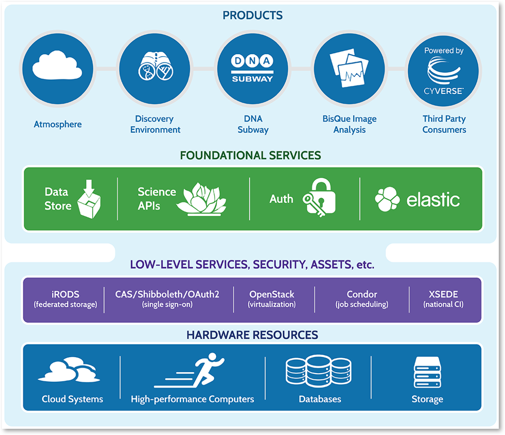

|CyVerse logo|

Workshop Code of Conduct
-------------------------
All attendees, speakers, sponsors and volunteers at our workshop are required 
to agree with the following code of conduct. Organisers will enforce this code 
throughout the event. We are expecting cooperation from all participants to 
help ensuring a safe environment for everybody. 

This Code of Conduct taken from 
http://confcodeofconduct.com/. See http://www.ashedryden.com/blog/codes-of-conduct-101-faq
for more information on codes of conduct.

**Learning objectives**
=======================

Participants will learn key containerization concepts for developing 
reproducible analysis pipelines, with emphasis on container lifecycle 
management from design, execution and scaling. 

The workshop will cover key concepts containers such as defining the 
architecture of Containers, building Docker images and pushing them to 
public and private repositories as well as we will show how to scale your 
analysis from laptop to cloud and to HPC systems using containers. 

**Who Should Attend**
=====================

Faculty, Postdocs, graduate students who use and analyze data of all
types (genomics, image data, from animals, plants, etc.).

**Workshop Level**
==================

This workshop focused on beginning users with little to no previous container
experience.

Intermeidate and advanced users attend to better understand container capabilities 
and resources, including deploying their own tools and extending these analyses 
into Cloud and HPC.

**Need Help?**
==============

You can reach the lead instructor, Upendra Devisetty, at upendra@cyverse.org. 
You can also talk to any of the instructors or TAs if you need immediate help, 
or (in an emergency) call 911.

-----

Pre-Workshop Setup
---------------------

These are the minimum Setup Instructions for the Container camp workshop at CyVerse, University of Arizona, which will run from March 7th to March 9th, 2017.

.. list-table::
    :header-rows: 1

    * - Prerequisite
      - Notes
      - Links
    * - Wi-Fi-enabled laptop
      - You should be able to use any laptop using Windows/MacOS/Linux.
        We **strongly recommend** Firefox or Chrome browser; **We do not recommend**
        **Microsoft Edge Browser**. It is recommended that you have administrative/install 
        permissions on your laptop.
      - - `Download FireFox <https://www.mozilla.org/en-US/firefox/new/?scene=2>`_
        - `Download Chrome <https://www.google.com/chrome/browser/>`_
    * - CyVerse Account
      - Please ensure that you have a CyVerse account and have **verfied** your account
        by completing the verification steps in the email you got when you registered.
        You can **test your account** by logging into `http://user.cyverse.org/ <http://user.cyverse.org/>`_.
      - Register for your cyverse account at `http://user.cyverse.org/`_. 
    * - Github Account
      - Please ensure that you have a Github account if you don't have one already
      - Register for your Github account at `https://github.com/ <https://github.com/>`_.
    * - Dockerhub Account
      - Please ensure that you have a Dockerhub account if you don't have one already
      - Register for your Dockerhub account at `https://dockerhub.com/ <https://dockerhub.com/>`_.
    * - Qauy.io Account
      - This is completely optional but recommended and can use github to log-in to quay.io account
      - Register for your Quay.io account at `https://quay.io/ <https://quay.io/>`_.    
    * - XSEDE Account
      - Please ensure that you have a XSEDE account by registering at XSEDE portal to access Jetstream cloud 
        computing
      - Register for your XSEDE account at `https://portal.xsede.org/ <https://portal.xsede.org/>`_.
    * - TACC Account
      - Please ensure that you have a TACC account to access Stampede2 HPC computer at TACC
      - Register for your TACC account at `https://portal.tacc.utexas.edu/ <https://portal.tacc.utexas.edu/>`_.
    * - Text Editor
      - Please ensure that you have a Text editor of your choice. Any decent text editor would be sufficient and
        recommended ones include Sublime2 and Atom
      - - Register for Sublime at `https://www.sublimetext.com/ <https://www.sublimetext.com/>`_.
        - Register for Atom at `https://atom.io/ <https://atom.io/>`_.
    * - Slack for networking
      - We will be using Slack extensively for communication and networking purposes
      - Register for Slack at `https://slack.com/ <https://slack.com/>`_.
    * - Cyberduck
      - Cyberduck is a third-party tool for uploading/downloading data to CyVerse.
        Currently, this tool is available for Windows/MacOS only. You will need
        to download Cyberduck and the connection profile. We will go through
        configuration and installation at the workshop.
      - - `Download Cyberduck <https://cyberduck.io/>`_
        - `Download CyVerse Cyberduck connection profile <https://wiki.cyverse.org/wiki/download/attachments/18188197/iPlant%20Data%20Store.cyberduckprofile?version=1&modificationDate=1436557522000&api=v2>`_

**Optional Download Extras**

These are some extra downloads that aren't required for the workshop, but which
provide some options for functionalities we will cover.

.. list-table::
    :header-rows: 1

    * - Tool
      - Notes
      - Link
    * - SSH Clients (Windows)
      - PuTTY allows SSH connection to a remote machine, and is designed for
        Windows users who do not have a Mac/Linux terminal. MobaXterm is a single 
        Windows application that provides a ton of functions for programmers, webmasters, 
        IT administrators, and anybody is looking to manage system remotely
      - - `Download PuTTY <https://www.chiark.greenend.org.uk/~sgtatham/putty/latest.html>`_
        - `Download mobaXterm <https://mobaxterm.mobatek.net>`_
    * - iCommands
      - iCommands are third-party software for command-line connection to the
        CyVerse Data Store.
      - Download and installation instructions available at `CyVerse Learning Center <https://cyverse-data-store-guide.readthedocs-hosted.com/en/latest/step2.html>`__

-----

Workshop Topics
----------------
These are the topics for the Container camp workshop at CyVerse, University of Arizona, which will run from March 7th to March 9th, 2017.

**Training session in Docker**
===============================

**Trainers (Upendra Devisetty, Kapeel Chougule, Paul Sarando and Ian McIwen)**    

This would be the introductory session for concept of Docker. In this session 
we will demonstrate how to containerize your software/applications using Docker, 
push them to Dockerhub and other registries and finally deploy them on cloud. 

**Docker basics/Introduction (Upendra and Kapeel)**

- Prerequisites
- Installing Docker on laptop (`Mac <https://docs.docker.com/docker-for-mac/install/>`_/`Windows <https://docs.docker.com/docker-for-windows/install/>`_/`Linux <https://docs.docker.com/install/linux/docker-ce/ubuntu/>`_)
- Running Docker containers from prebuilt image
- Building Docker images 
  
  - Manually using Docker commit
  - Automated using Dockerfile
- Dockerfile concepts

  - Advanced Dockerfile
  - Best practices for writing Dockerfile 
- Running containers from custom built images  
- Building webapps using Docker

  - Static websites
  - Dynamic websites
- `Portainer <https://portainer.io/>`_ demo for managing Docker containers and images
- `Play-with-Docker <http://www.play-with-docker.com/>`_ demo for testing Docker containers
- Hands-on and exercises

**Advanced docker (Paul and Ian)**

- Docker registries (`Docker cloud <https://cloud.docker.com/>`_, `Docker hub <https://hub.docker.com/>`_, `quay.io <https://quay.io/>`_ and local registries)

  - Finding images
  - Pushing images 
  - Pulling images
  - Sharing images
- Automated Docker image building from github and bitbucket
- Exposing ports on running Containers
- Working with volumes (creating and binding volumes)
- Managing data for analysis in Docker containers
- Optimizing Dockerfiles: Multi-stage builds
- Manage sensitive data with Docker secrets
- Docker Compose for multi container apps
- Improving your data science workflow using Docker containers
- Putting it all together: Deploying an app in Discovery Environment
- Hands-on and exercises

**Training session in Singularity**
===================================

**Trainers (Tyson Swetnam and John Fonner)**    

This would be the introductory session for concept of Singularity. In this part we will 
show you how to containerize your software/applications using Singularity, push them to 
Singularityhub and deploy them on cloud and HPC.

**Singularity basics/Introduction (Tyson Swetnam)**

- Prerequisites/Requirements
- Installing Singularity on laptop (`Mac <http://singularity.lbl.gov/install-mac>`_, `Windows <http://singularity.lbl.gov/install-windows>`_, `Linux <http://singularity.lbl.gov/install-linux>`_)
- Loading Singularity module on HPC/XSEDE
- Docker vs Singularity
- Running Singularity container from pre-built image
- Building Singularity container

  - Manually
  - Bootstrapping using Singularity file
- Examples of Singularity images

**Advanced Singularity (John Fonner)**

- `Singularityhub <https://singularity-hub.org/>`_ introduction

  - Finding images
  - Pushing images 
  - Pulling images
  - Sharing images
- Automated Singularity image building from github and bitbucket
- Working with volumes (creating and binding host system directories into a container)
- Managing data for analysis in Singularity containers
- Docker2Singularity

**Training session in Biocontainers**
=====================================

**Trainer (Upendra Devisetty)**

This would be the introductory session for concept of Biocontainers. In this session 
we will show you how to containerize your bioinformatic software/applications 
(with special focus in Proteomics, Genomics, Transcriptomics and Metabolomics), push 
them to Dockerhub and other registries and finally deploy them on cloud.

- Introduction to `Biocontainers <https://biocontainers.pro/>`_

  - Docker based Biocontainers
  - Bioconda based BioContainers
- BioContainers vs Docker Containers
- BioContainers Architecture
- How to request a workflow?
- Use a BioContainer

  - Developing containers
  - Creating BioContainers
- Dockerfile based BioContainers
- Conda Package based BioContainers
- Running Biocontainers
- Biocontainers registry

  - Dockerhub
  - Quay.io
- Common Workflow languages (CWL) and Biocontainers
- Contribute to BioContainers

**Training session in scaling up your analysis using containers**
====================================================================

**Trainer (Tyson Swetnam)**  

This would be the final session of the workshop where we will show you how 
to scale your analyses (simple apps and complex workflow) from Laptop to Cloud to 
HPC and also show how using several compute clusters can scale your analysis significantly.

- `Docker swarm <https://docs.docker.com/engine/swarm/>`_ for distributed computing using Play-With-Docker (PWD)
- `Google Kubernetes <https://kubernetes.io/>`_
- Workflows Management Systems using containers (Docker and Singularity)

  - `Pegasus <https://pegasus.isi.edu/>`_
  - `Work-Queue <https://ccl.cse.nd.edu/software/workqueue/>`_
  - `Makeflow <https://ccl.cse.nd.edu/software/makeflow/>`_

----

Agenda
--------
These are the schedule and classroom materials for the Container camp workshop at University of Arizona, which will run from March 7th to March 9th, 2018.

This workshop runs under a `Code of Conduct <https://cyverse-container-camp-workshop-2018.readthedocs-hosted.com>`_. Please respect it and be excellent to each other!

Twitter hash tag: #cc2018

.. list-table::
    :header-rows: 1

    * - Day
      - Time
      - Topic/Activity
      - Slides
      - Notes/Links
    * - 03/07/18 (Wednesday)
      - 8:30-8:45
      - General introduction to CyVerse (Parker Antin)
      - 
      -
    * - 03/07/18 (Wednesday)
      - 8:45-9:00
      - Welcome to Container camp (Upendra Devisetty)
      - 
      - 
    * - 03/07/18 (Wednesday)
      - 9:00-10:00
      - General overview of Container Technology (Nirav)
      -
      -
    * - 03/07/18 (Wednesday)
      - 10:00-10:30
      - Coffee break and networking
      -
      -
    * - 03/07/18 (Wednesday)
      - 10:30-12.00
      - Docker basics (Upendra/Kapeel)
      -
      -
    * - 03/07/18 (Wednesday)
      - 12:00-01:00
      - Lunch break with networking
      -
      -
    * - 03/07/18 (Wednesday)
      - 01:00-2:30
      - Advanced Docker (Paul/Ian)
      - 
      -
    * - 03/07/18 (Wednesday)
      - 2:30-3:00
      - Coffee break with networking
      -
      -
    * - 03/07/18 (Wednesday)
      - 03:00-06:00
      - BYOD
      -
      -
    * - 03/08/18 (Thursday)
      - 8:30-9:00
      - TBD
      - 
      -
    * - 03/08/18 (Thursday)
      - 9:00-10:00
      - General overview of Singularity (John Fonner)
      -
      -
    * - 03/08/18 (Thursday)
      - 10:00-10:30
      - Coffee break and networking
      -
      -
    * - 03/08/18 (Thursday)
      - 10:30-12.00
      - Singularity basics (John Fonner/Tyson Swetnam)
      -
      -
    * - 03/08/18 (Thursday)
      - 12:00-01:00
      - Lunch break with networking
      -
      -
    * - 03/08/18 (Thursday)
      - 01:00-2:30
      - Advanced Singularity (John Fonner)
      - 
      -
    * - 03/08/18 (Thursday)
      - 2:30-3:00
      - Coffee break with networking
      -
      -
    * - 03/08/18 (Thursday)
      - 03:00-06:00
      - BYOD
      -
      -
    * - 03/09/18 (Friday)
      - 8:30-10:00
      - Dockerized Pegasus WMS (Mats Rynge)
      - 
      -
    * - 03/09/18 (Friday)
      - 10:00-10:30
      - Coffee break and networking
      -
      -
    * - 03/09/18 (Friday)
      - 10:30-12.00
      - Scaling up and out (distributed computing with containers) (Tyson Swetnam) 
      -
      -
    * - 03/09/18 (Friday)
      - 12:00-01:00
      - Lunch break with networking
      -
      -
    * - 03/09/18 (Friday)
      - 01:00-2:30
      - Bocontainers (Upendra Devisetty)
      - 
      -
    * - 03/09/18 (Friday)
      - 2:30-3:00
      - Coffee break with networking
      -
      -
    * - 03/09/18 (Friday)
      - 03:00-06:00
      - BYOD
      -
      -

------

About CyVerse
-------------

**CyVerse Vision:** Transforming science through data-driven discovery.

**CyVerse Mission:** Design, deploy, and expand a national
cyberinfrastructure for life sciences research and train scientists in
its use. CyVerse provides life scientists with powerful computational
infrastructure to handle huge datasets and complex analyses, thus
enabling data-driven discovery. Our powerful extensible platforms
provide data storage, bioinformatics tools, image analyses, cloud
services, APIs, and more.

While originally created with the name iPlant Collaborative to serve
U.S. plant science communities, CyVerse cyberinfrastructure is germane
to all life sciences disciplines and works equally well on data from
plants, animals, or microbes. By democratizing access to supercomputing
capabilities, we provide a crucial resource to enable scientists to find
solutions for the future. CyVerse is of, by, and for the community, and community-driven needs
shape our mission. We rely on your feedback to provide the
infrastructure you need most to advance your science, development, and
educational agenda.

**CyVerse Homepage:** `http://www.cyverse.org <http://www.cyverse.org>`_

Funding and Citations
---------------------

CyVerse is funded entirely by the National Science Foundation under
Award Numbers DBI-0735191 and DBI-1265383.

Please cite CyVerse appropriately when you make use of our resources,
`CyVerse citation
policy <http://www.cyverse.org/acknowledge-cite-cyverse>`__

.. |CyVerse logo| image:: ./img/cyverse_rgb.png
	:width: 500
	:height: 100

